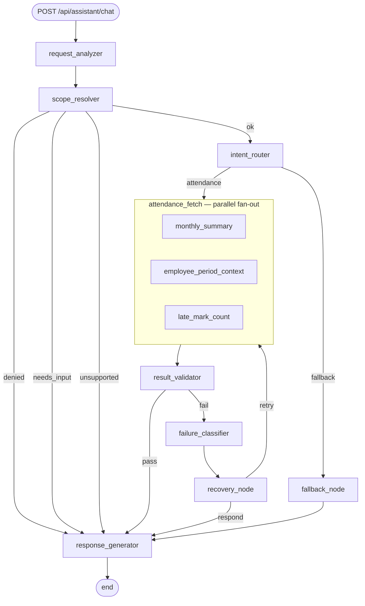

# HRM Assistant — Graph Architecture

A stateful workflow graph that answers employee attendance questions by
orchestrating the **existing** HRMS services. It adds no business logic, no new
dependencies, and no new authorisation model.

Entry point: `POST /api/assistant/chat`
Code: `Attendance Management/backend/app/assistant/`

---

## 1. Why a hand-rolled graph runtime

LangGraph is not used. The HRMS backend and the Resume Analyzer share one
virtualenv, and `requirements.txt` pins a deliberately "COMPATIBLE SET"
(`langchain==0.1.20`, `langchain-core==0.1.52`) for the NuExtract extraction
chain. Current LangGraph requires `langchain-core>=0.2.43`; installing it would
force an upgrade that breaks resume extraction.

`app/assistant/runtime.py` therefore implements the primitives directly —
~350 lines, zero new packages — with an API that mirrors LangGraph's
(`add_node`, `add_edge`, `add_conditional_edges`, `compile`, `invoke`, `END`),
so migrating later is an import change rather than a rewrite.

## 2. The graph

> This diagram is verified by `test_mermaid_reflects_the_real_topology`.
> `StateGraph.mermaid()` renders it from the compiled graph, so it cannot drift.

Two deliberate departures from the original sketch:

* **The security gate precedes routing.** Denials must not depend on which
  domain node happens to run, and an unauthorised request should perform no work.
* **Retry re-enters `attendance_fetch`, not the router.** The only retryable
  failures are transient tool failures; the route was already correct, so
  re-running analysis would spend time (and possibly an LLM call) reaching an
  identical decision.

## 3. Nodes

| Node | Responsibility | LLM? |
|---|---|---|
| `request_analyzer` | Normalise text; resolve the month/year (IST-anchored) and whether the question is about self / another / a team. Flags unsupported granularities ("last quarter") and marks an assumed period. | No |
| `scope_resolver` | **Security gate.** Derives `target_employee_id` from the authenticated user, applies role rules, resolves a named employee within what the actor may see. | No |
| `intent_router` | Weighted keyword scoring → `attendance` / `leave` / `payroll` / `unknown`. Consults the LLM only on a genuine tie, constrained to a fixed label set. | Tie-break only |
| `attendance_fetch` | Parallel fan-out over three independent reads. Each branch owns its Session and classifies its own failures. | No |
| `result_validator` | Deterministic checks: critical tool present, shape, numeric types, calendar arithmetic, business rules. | No |
| `failure_classifier` | Pure decision: `retry` / `clarify` / `reroute` / `degrade`. | No |
| `recovery_node` | Executes that decision; decrements budget and increments iteration. The only node that goes backwards. | No |
| `fallback_node` | Honest "no", naming a recognised-but-unbuilt capability and suggesting an HR query. | No |
| `response_generator` | Single exit. Renders figures from a template; optionally lets the LLM rephrase, **rejecting any rewrite that changes a number**. | Phrasing only |

## 4. State

`app/assistant/state.py` — `AssistantState`, a `TypedDict`.

Three properties it maintains:

* **Small.** Ids, enum-ish strings, counts and aggregate dicts. No ORM objects,
  no `User`, no raw record lists. Database handles live in `RunContext`, not state.
* **Log-safe.** `redacted(state)` is what reaches the logs: the message becomes a
  length, and nothing else in state identifies a person.
* **Authorisation is a value.** `target_employee_id` is written once, by
  `scope_resolver`, from the authenticated actor.

## 5. Routing

`app/assistant/edges.py` holds the predicates as pure functions, so routing is
testable without a graph or a database.

| Edge | Labels |
|---|---|
| `scope_resolver` | `ok` · `denied` · `needs_input` · `unsupported` |
| `intent_router` | `attendance` · `fallback` |
| `result_validator` | `pass` · `fail` |
| `recovery_node` | `retry` · `respond` |

The runtime raises if a predicate returns a label the mapping doesn't cover — an
unhandled state cannot silently fall through.

## 6. Failure handling

`app/assistant/failures.py` is the single place that decides what a failure kind
means:

| Group | Kinds | Disposition |
|---|---|---|
| `RETRYABLE` | `transient`, `timeout` | retry, while budget and novelty permit |
| `CLARIFIABLE` | `missing_entity`, `invalid_input` | ask one question, stop |
| `REROUTABLE` | `validation_failure` | alternate route (phase 2) |
| `TERMINAL` | `authz_failure`, `business_rule`, `unsupported`, `missing_data` | never retried |

## 7. Loop engineering

There is exactly **one** cycle: `attendance_fetch → result_validator →
failure_classifier → recovery_node → attendance_fetch`.

Four independent stopping conditions:

1. `MAX_ITERATIONS = 2`
2. `retry_budget = 2`, decremented each pass
3. **Failure-signature novelty** — a repeated `kind:detail` degrades immediately.
   A budget alone still lets a deterministic failure consume every attempt.
4. `max_steps=24` in the runtime, plus a 20s wall-clock deadline — engine-level
   backstops that hold regardless of what the nodes believe.

## 8. Security boundaries

* Authentication is unchanged: the route uses `require_roles(["Admin", "HR",
  "Manager", "Employee"])`, the same dependency as every other HRMS endpoint.
* `target_employee_id` is **never** parsed from the message and never produced by
  the LLM. Prompt injection can express intent; it cannot widen access.
* The role check runs **before** the lookup — an Employee asking about a
  colleague is denied with zero database queries, so the assistant is not an
  existence oracle for employee names.
* A Manager's lookup is scoped to `reporting_manager_id`, making "not your
  reportee" indistinguishable from "no such employee".
* No API credentials are exposed to the LLM. Tools are in-process function calls.
* The per-node trace is returned to Admin/HR only.

## 9. Dependencies

Tools call `app.services.attendance_service` and read `Employee` /
`AttendanceRecord` directly. No HTTP, no MCP, no re-implemented attendance
rules — `monthly_attendance_summary` remains the single source of truth for how
a day is classified.

## 10. Observability

Every run emits one `assistant.run` line (duration, node count, LLM calls, tool
calls, retries, redacted state) and one `assistant.node` line per node —
including each parallel branch — with node name, status, duration, iteration and
metadata. Together these reconstruct: request → node → decision → tool → result
→ validation → next node.

## 11. Testing

| File | Covers |
|---|---|
| `tests/test_assistant_runtime.py` | Engine: ordering, merging, conditional edges, parallel concurrency and merge conflicts, cycle bounding, error node, deadline, tracing |
| `tests/test_assistant_nodes.py` | Each node in isolation, no DB |
| `tests/test_assistant_security.py` | The authorisation gate, including prompt injection |
| `tests/test_assistant_graph.py` | Whole runs asserted on path and outcome |

All external calls are substituted at the tool boundary. No test touches a
database, a network or a model.

## 12. Configuration

| Variable | Default | Effect |
|---|---|---|
| `ASSISTANT_LLM_ENABLED` | `false` | When false the graph is fully deterministic and never imports torch/transformers. When true, the Resume Analyzer's TinyLlama pipeline is used for router tie-breaks and answer phrasing. |
